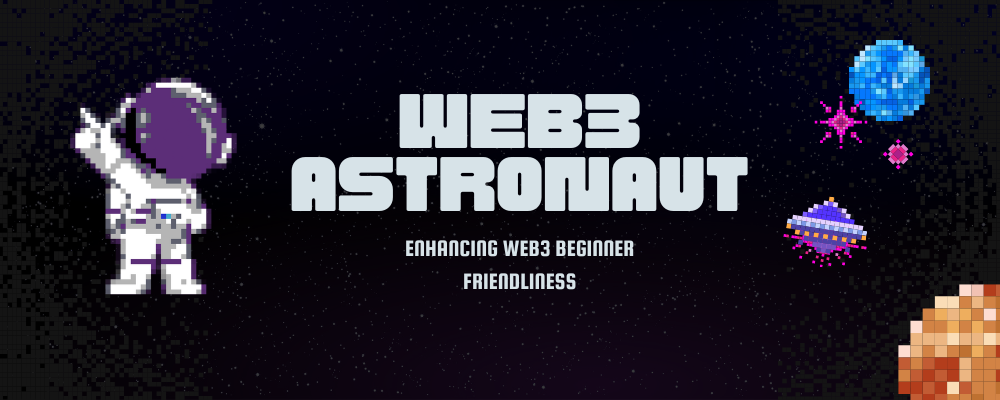

# Welcome to Web3 Astronaut 🎓👨🏽‍🚀🌸

---

Even if you are a professional, Web3 has a tonne of fresh content to offer. Dedicated to the development of the web, Web3 Astronaut is a community. While having fun with other community members, you can learn how to become a blockend developer here. You can demonstrate your leadership qualities and contribute to everyone's success now that this community is only getting started.

---

Come and join us as we transform Web3 for beginners.💖

---

Check out some of our cool web3 projects below! 👇
